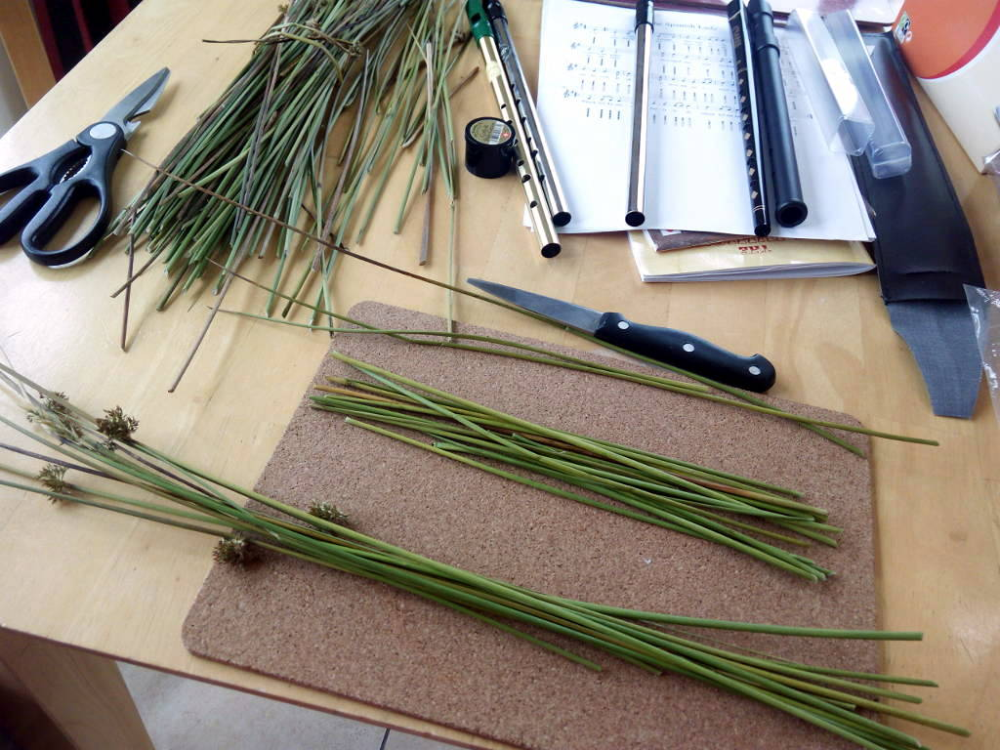
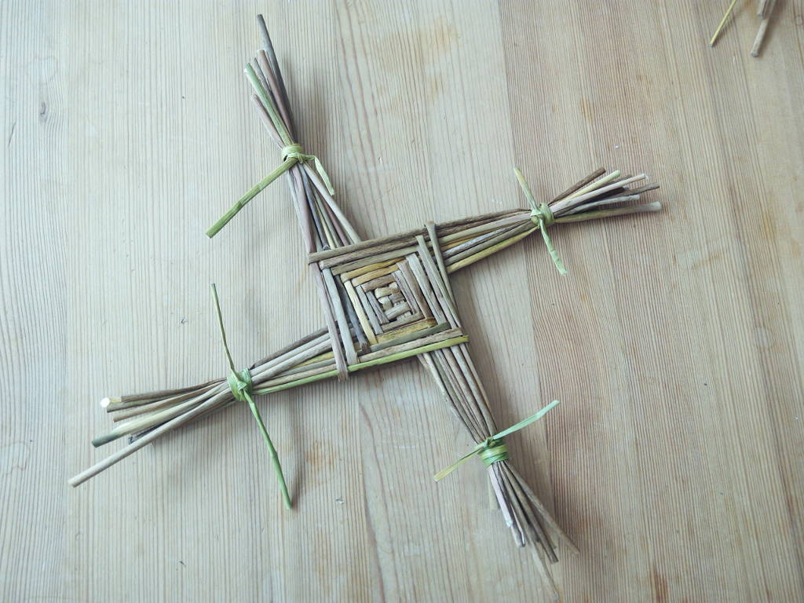
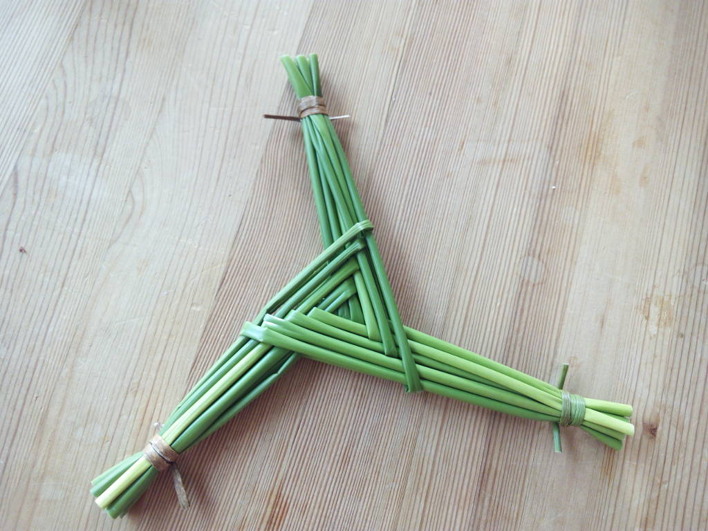
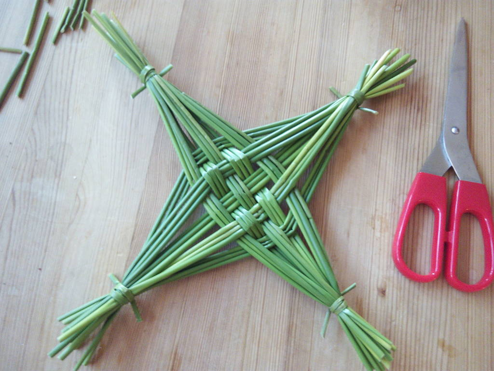
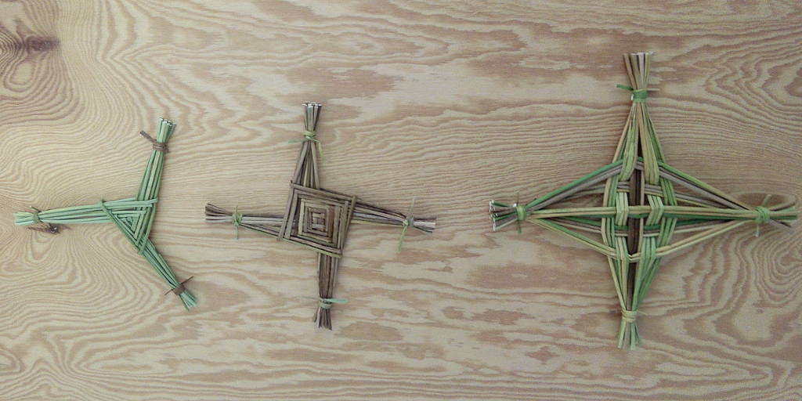

# Crafting
Some DIY crafting instructions

# Abstract

This project collects descriptions and instructions on different crafting ideas and how to craft these.

Descriptions might not be in full detail. So as a prerequisite it might be helpful to have some experience in crafting stuff and knowledge on material and tools in use here. Be careful what you are doing to avoid damage or injuries while crafting.

Mind no warranties are given. The license may not give you all of the permissions necessary for your intended use. For example, other rights such as publicity, privacy, or moral rights may limit how you use the material. 

# Instructions

## Saint Brigid's Cross

Traditionally the St. Brigid's Cross is made of rushes. Tools needed for creation are a knife or a scissor only. Ignore the tin whistles on the picture shown. You won't believe it but these are definitively not needed here. To avoid scratches on the table you could decide to use a place mat, too.

__@TODO:__ _Add step by step instructions plus some illustrations_

This is the popular squared variant of Saint Brigid's Cross.

An alternative variant is the triangular Saint Brigid's Cross.

__@TODO:__ _Describe difference towards squared variant. Add step by step instructions plus some illustrations_

Braiding and weaving the fishermen's variant of the Saint Brigid's Cross.

__@TODO:__ _Give hints on how to create this, too._

Enjoy...

### Contributors / Authors

<table>
  <tr>
    <td>
Oliver Merkel,  This image is licensed under a <a rel="license" href="http://creativecommons.org/licenses/by-nc-nd/4.0">Creative Commons Attribution-NonCommercial-NoDerivatives 4.0 International License</a>.    
    

    </td>
    <td width="50%"></td>
  </tr>
</table>

_All logos, brands, and trademarks mentioned belong to their respective owners._
